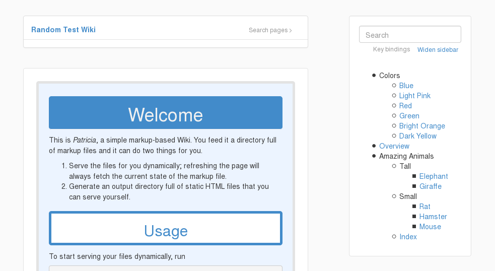
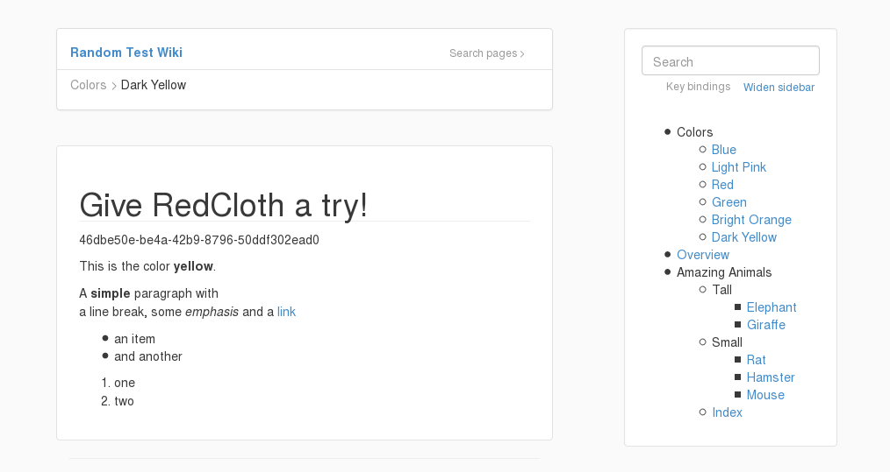
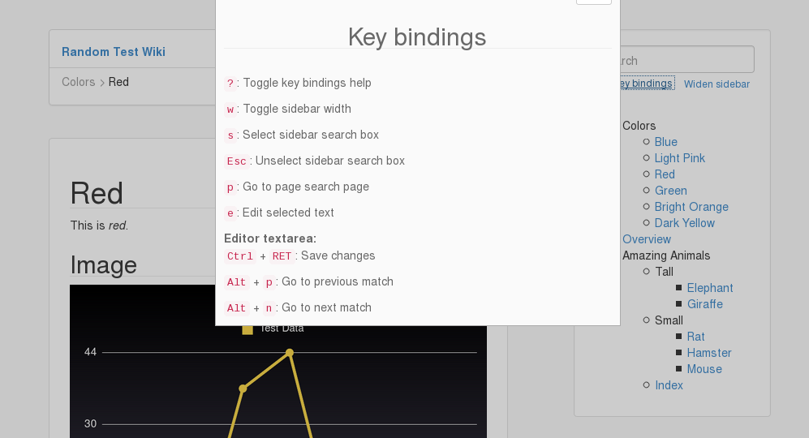
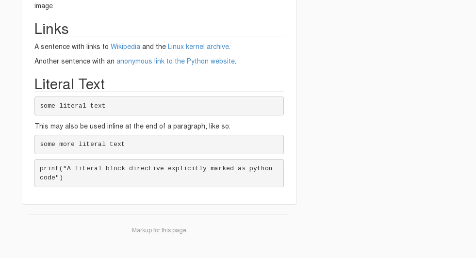
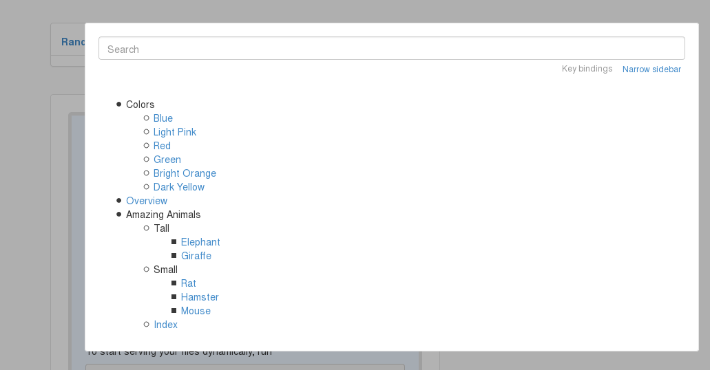
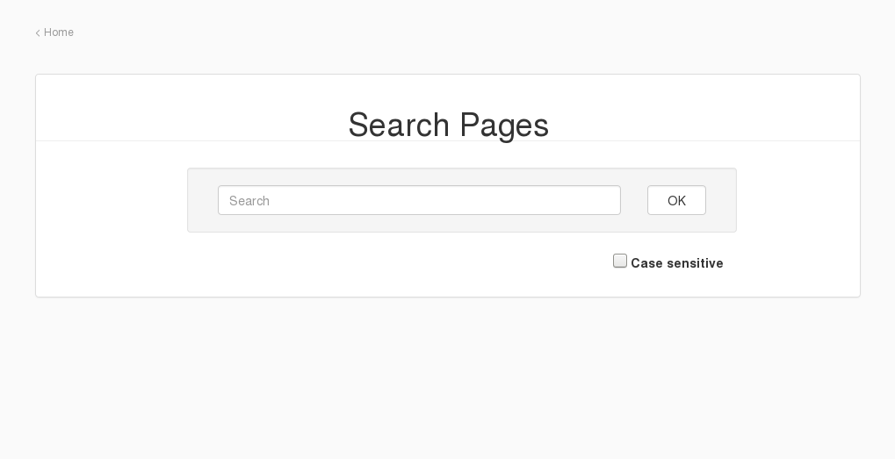
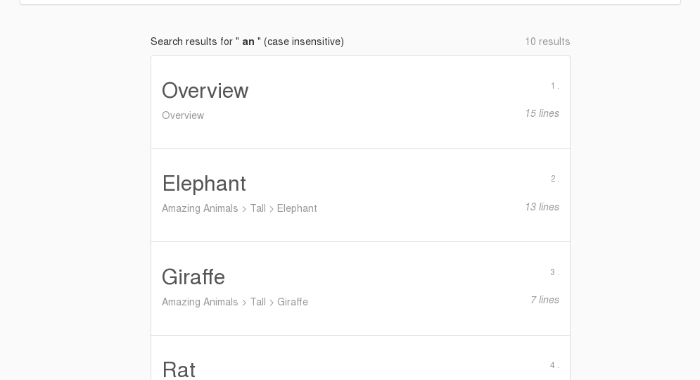

# Patricia

Patricia is a simple markup-based Wiki. You give it a directory full of
markup files and it either

- serves the markup files as dynamic HTML pages with a hierarchical list of
  all pages in a handy sidebar (including a search box) or
- generates a directory full of static HTML pages that you can serve
  yourself.

The first option is great for writing/previewing your markup files. You
simply refresh the page and Patricia picks up the current state of the
file. However, it is also perfectly fine to use this built-in server to
serve your Wiki as a real website.

Files of different supported markup languages can be wildly mixed in the
markup directory, Patricia is able to figure it out as long as you use the
right file extension. Static files (images/PDFs/video/...) in the markup
directory are served as is, so you can link to them from any page and the
links will not break.

Patricia also comes with some optional goodies:
  
- Basic markup editor (`-e` flag) that allows you to select an element or
  highlight text on a page and brings up the corresponding markup, if it
  can figure it out.
- Tooltips (`-t` flag) which show you the full file path for every
  directory and file in the sidebar by hovering over it.
- RegEx search across all pages (if you tag your pages using a consistent
  pattern, you can use this to get a list of all pages for certain tags).
- GitHub Flavored Markdown/Markup support (`-g` flag)

## Installation

        gem install patricia

## Quick Start

Run

        patricia /path/to/markup/dir -p 4321

and point your browser to `http://localhost:4321/`. Patricia will tell you
what to do from that point on.

## Usage

To serve a directory full of markup files (`dir`), run this:

        patricia /path/to/dir

To generate static HTML files in an output directory (`outputdir`), run
this:

        patricia /path/to/dir /path/to/outputdir

To use your own stylesheets use the `--css` command line switch, to include
your own JavaScript, use `--js`. If you want to use a custom port, the
`--port` comes in handy.

Run `patricia --help` to see a list of all options.

## Markup Languages

Patricia supports the following markup languages (supported file
extensions in parentheses) - except when using the `-g` command line
switch *(see below)*:

- Markdown (`.md`, `.markdown`) via `kramdown`
- Org (`.org`) via `org-ruby`
- Textile (`.textile`) via `redcloth`
- reStructuredText (`.rst`, `.rest`, `restx`) via `pandoc-ruby`

To add support for a new language do this:

0. *Write tests*
1. Add a method with the markup language name to `Patricia::Converter`
   (This function takes a markup string as input and returns a HTML string
   as output)
2. Associate this new method with the desired file extensions for the new
   markup language by adding mappings to the
   `Patricia::Converter.converters` hash.
3. Add those file extensions to `PatriciaApp::App`'s
   `settings.app_markdown_glob` in its `configure` block.
4. Add the file extensions to the `settings.app_content_types` hash in
   `PatriciaApp::App` and map them to the `text/plain` content type, if
   possible, so that browsers will display them on a page instead of
   prompting to download the file.
5. *Make sure the tests pass*

Alternatively one can use the `-g` flag to force the usage of the
`github-markup` gem to render all pages. This lets you use GitHub Flavored
Markdown. It will render *all* pages of any markup type using this gem, not
only Markdown. As a result, when using `-g`, all the markup languages of
the `github-markup` gem are supported.

## Editor

Patricia's rudimentary and completely optional markup editor can
be enabled using the `-e` flag. It allows you to edit the markup for
editable components by hovering over them or by simply selecting text. It
tries its best to figure out which part of the markup is responsible for
the selected element and highlights it so that one can immediately jump to
the corresponding markup for quick fixes or even larger changes. Keep in
mind that this is not perfect, but it definetly is usable and is quite
handy for a lot of small fixes across multiple files as well as correcting
typos.

## Page search

There is the search box in the sidebar that allows you to quickly search
all page titles, but there is also a buillt-in search page that allows you
to search the actual text of each page using regular expressions. So if you
include (hash) tags on your pages, you can use this to search all matching
pages, for instance.

## Screenshot

*Welcome page*

*Wiki page*

*Key bindings*

*Markup rendering and link to page source*

*Expanded sidebar with quick-search*

*Dedicated search page*

*Search results*
